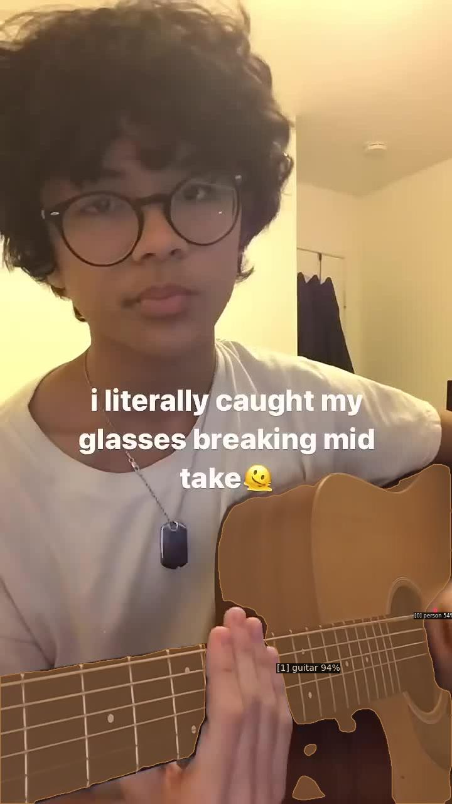

# 3D-AVSplat

## Installation

```bash
apt-get update
apt-get install ffmpeg python3.8-dev

# Create and activate virtual environment
python3.8 -m venv .venv
source .venv/bin/activate

# Install dependencies
export PIP_CACHE_DIR=/data/.cache/pip
pip install --cache-dir=$PIP_CACHE_DIR -r requirements.txt

# install detectron, mask2former
cd avis/avism/detectron2
pip install -e .
cd ../../mask2former/modeling/pixel_decoder/ops
sh make.sh
cd ../../../../

# download AVIS checkpoints
# https://github.com/ruohaoguo/avis
mkdir pre_models # and download pre-trained backbones
mkdir checkpoints # and download model checkpoints

# download VGGISH checkpoints, params
cd ../audio_feature_extractor/
wget https://storage.googleapis.com/audioset/vggish_model.ckpt
wget https://storage.googleapis.com/audioset/vggish_pca_params.npz

# move back to project root
cd ..
```

## Usage

1. Place your target video (must be mp4 format) in the `samples/` folder

2. Run the following command in the project root:
   ```bash
   python preprocess.py -s your_video_name.mp4 -c 1.0
   ```
   This will segment the video into chunks based on audio silence detection

   Optional arguments:
   - `-m, --model`: Audio segmentation model name (default: SAT_T_1s)
   - `-c, --chunk_length`: Length of each chunk in seconds (default: 0.25, choices: [0.25, 0.5, 1.0])
     - 0.25s chunks: 4 fps
     - 0.5s chunks: 2 fps
     - 1.0s chunks: 1 fps
   - `-s, --sample_name`: Name of the input video file (default: funny_dogs.mp4)

2.1. The output will be organized as follows:
   ``` 
   samples_chunked/
      └── FEATAudios/
         ├── your_video_name_st1_et1.npy
         ├── your_video_name_st2_et2.npy
         └── your_video_name_st3_et3.npy
      └── FEATAudios_CLAP/
         ├── your_video_name_st1_et1.npy
         ├── your_video_name_st2_et2.npy
         └── your_video_name_st3_et3.npy
      └── JPEGImages/
         ├── your_video_name_st1_et1
         │    ├── frame1.jpg
         │    ├── frame2.jpg
         │    ├── ....
         ├── your_video_name_st2_et2
         │    ├── frame1.jpg
         │    ├── ...
         └── your_video_name_st3_et3
              ├── ...
      └── WAVAudios/
         ├── your_video_name_st1_et1.wav
         ├── your_video_name_st2_et2.wav
         └── your_video_name_st3_et3.wav
   ```


3. Run the following command in the project root:
   ```bash
   python segment_2d.py
   ```
   This will apply 2D audio-visual segmentation by frame level.

   Optional arguments:
   - `--config-file`: Path to config file (default: avis/configs/avism/R50/avism_R50_IN.yaml)
   - `--input-dir`: Directory containing input video frames (default: samples_chunked/JPEGImages/)
   - `--output-dir`: Directory to save output visualizations (default: samples_avis/)
   - `--audio-dir`: Directory containing audio features (default: samples_chunked/FEATAudios/)
   - `--confidence`: Minimum score for instance predictions (default: 0.3)

3.1. The output will be organized as follows:
   ``` 
   samples_avis/
      └── your_video_name_st1_et1/
         ├── binary_masks/
         |     └── # AVS bitmasks visualization
         ├── masks/
         |     └── # AVS bitmasks
         ├── 0000001.jpg # AVS visualization
         ├── 0000002.jpg # AVS visualization
         ├── ...
      └── your_video_name_st2_et2/
         ├── binary_masks/
         |     └── # AVS bitmasks visualization
         ├── masks/
         |     └── # AVS bitmasks
         ├── 0000001.jpg # AVS visualization
         ├── 0000002.jpg # AVS visualization
         ├── ...
   ```

| Visualization | Binary Mask |
|:---:|:---:|
|  |  |
